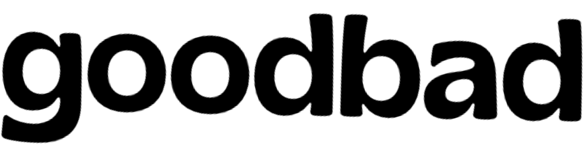
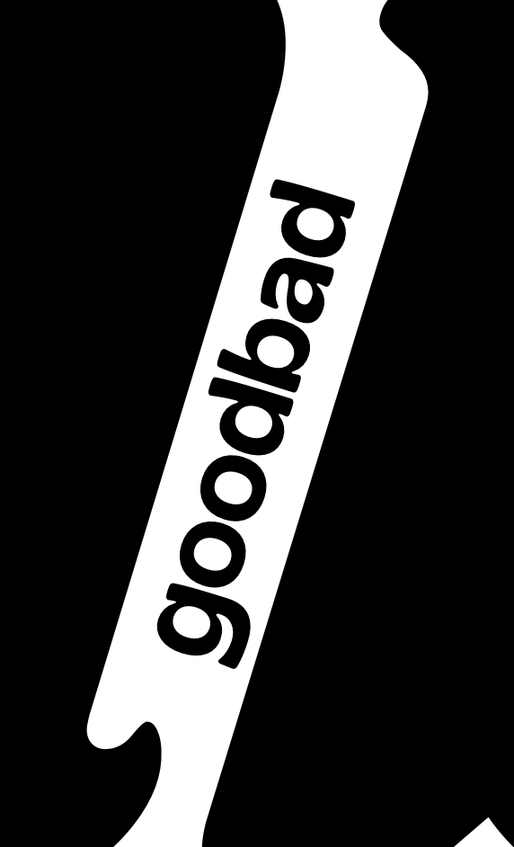

# 

  <em><strong>the good and the bad, not ugly</strong></em>

---
 

🧭 **An AI-powered moral compass** — this app lets you describe any situation, and it returns thoughtful responses based on a variety of ethical and spiritual worldviews.

Ever wondered what Buddhism, Stoicism, Christianity, or Jungian psychology might say about a decision you're facing? Now you can compare these perspectives side by side — transparently and grounded in real texts.

  ☯ ☦ ☩ ☸ ✡ ∞ ✝ ☥ ☪ ⚛

<table style="border-collapse: collapse; border: none; width: 100%;">
  <tr>
    <td style="border: none; padding-right: 50px;">
       
      &nbsp;&nbsp;It draws from:  
      &nbsp;&nbsp;&nbsp;&nbsp;&nbsp;&nbsp;❁&nbsp;    Ancient and modern <b>philosophy</b> &nbsp;&nbsp;&nbsp;&nbsp;&nbsp;&nbsp;&nbsp;&nbsp;&nbsp;&nbsp;&nbsp;&nbsp;&nbsp;&nbsp; Plato, Kant, Nietzsche...  
      &nbsp;&nbsp;&nbsp;&nbsp;&nbsp;&nbsp;❁&nbsp;   Foundational <b>religious texts</b> &nbsp;&nbsp;&nbsp;&nbsp;&nbsp;&nbsp;&nbsp;&nbsp;&nbsp;&nbsp;&nbsp;&nbsp; the Bible, Quran, Bhagavad Gita, Tao Te Ching...&nbsp;&nbsp;&nbsp;&nbsp;&nbsp;&nbsp;&nbsp;&nbsp;&nbsp;&nbsp;&nbsp;&nbsp;&nbsp;&nbsp;&nbsp;&nbsp;&nbsp;&nbsp;&nbsp;&nbsp;&nbsp;&nbsp;&nbsp;   
      &nbsp;&nbsp;&nbsp;&nbsp;&nbsp;&nbsp;❁&nbsp;&nbsp;&nbsp;&nbsp;   Influential <b>psychological theories</b> &nbsp;&nbsp;&nbsp;&nbsp;&nbsp;&nbsp;&nbsp;&nbsp;&nbsp;&nbsp;&nbsp;&nbsp;&nbsp;&nbsp;Freud, Jung, Haidt, and more
        
    </td>
      
    <td style="text-align: center;">
       

  <em><strong>Click here ⤵</strong></em>

      
    </td>
  </tr>
</table>

<h2 align="center">Why This Matters</h2>
Ethical AI shouldn't just reflect one worldview — it should help us understand **many**. By drawing from centuries of philosophy, religion, and psychology, this project aims to:

- Create space for **comparative moral reasoning**
- Ground responses in **transparent sources**
- Offer a **thoughtful tool** for anyone navigating ethical decisions

Whether you're a student of ethics, a curious thinker, or someone who just wants to understand what "good" really means — you're welcome here.

  

---

🔧 *Coming soon: tech stack, usage examples, roadmap, and contribution guide.*

